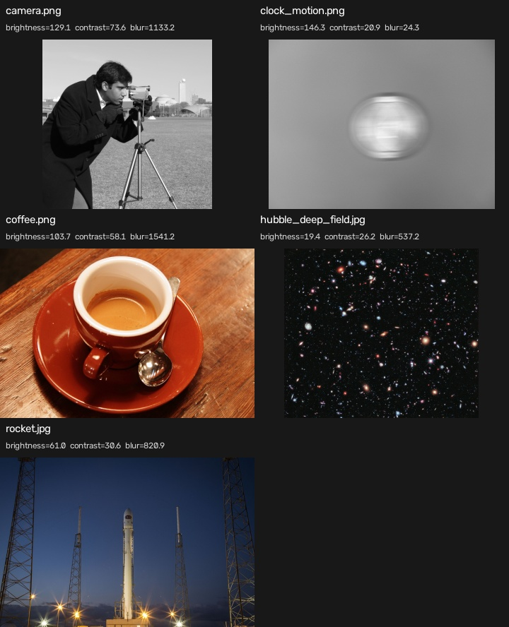

# Image Dataset Inspector

[](https://github.com/cab0a/image-dataset-inspector/actions/workflows/ci.yml)

## Overview

Image Dataset Inspector is a small Python command-line tool that recursively scans JPEG and PNG files, verifies that OpenCV can decode them, calculates simple image statistics, and writes a CSV inventory.

The project focuses on a narrow, reproducible workflow suitable for early dataset checks. It continues scanning when an individual file cannot be read and records the failure in the report.

## Problem

Image datasets often contain a mixture of valid images, corrupted files, inconsistent dimensions, and files with different visual characteristics. Discovering these issues before model training or image-processing experiments makes later failures easier to diagnose.

This tool provides a deterministic first-pass inventory without attempting to decide whether an image is suitable for a specific model or application.

## Features

- Recursively discovers `.jpg`, `.jpeg`, and `.png` files
- Records paths relative to the inspected directory
- Reports file size, dimensions, and channel count
- Calculates brightness, contrast, and a simple blur score
- Records unreadable images without stopping the scan
- Writes a UTF-8 CSV report
- Prints scanned, valid, and unreadable file counts
- Includes a fully synthetic demo dataset and unit tests

## Quick Start

Python 3.10 or later is required.

On Debian or Ubuntu, install the distribution-provided `python3-venv` package if `venv` reports that `ensurepip` is unavailable.

```bash
python3 -m venv .venv
source .venv/bin/activate
python -m pip install --upgrade pip
python -m pip install ".[dev]"
python examples/generate_demo_images.py --output demo_images
image-dataset-inspector inspect demo_images --output report.csv
```

Expected CLI summary:

```text
Scanned: 6
Valid: 5
Unreadable: 1
Report: report.csv
```

Run the tests with:

```bash
python -m pytest
```

## Usage

```text
image-dataset-inspector inspect INPUT_DIRECTORY --output REPORT.csv
```

Example:

```bash
image-dataset-inspector inspect ./images --output report.csv
```

The scan completes and writes a report even when individual files are unreadable. An invalid input directory or an unwritable report destination returns a non-zero exit code.

## Public Image Sample

A reproducible real-image example downloads five CC0 or public-domain photographs from the scikit-image sample data, verifies their SHA-256 hashes, and generates a CSV report and contact sheet.

```bash
python examples/run_public_sample.py
```



The sample demonstrates that the metrics describe image content rather than absolute quality. In particular, dark images can still contain strong local detail, and Laplacian variance is influenced by texture, noise, scale, and blur. See the [public sample analysis and attribution](examples/public_sample/README.md) for the results, interpretation, and image licenses.

## Output Schema

| Column | Description |
| --- | --- |
| `relative_path` | POSIX-style path relative to the inspected directory |
| `file_size_bytes` | File size in bytes |
| `width` | Decoded image width in pixels |
| `height` | Decoded image height in pixels |
| `channels` | Number of decoded image channels |
| `brightness` | Mean grayscale intensity |
| `contrast` | Standard deviation of grayscale intensities |
| `blur_score` | Variance of the grayscale Laplacian |
| `status` | `valid` or `unreadable` |
| `error_message` | Readable explanation when inspection fails |

Unavailable values are written as empty CSV fields. Metric values are written with six decimal places.

## Methodology

OpenCV loads each image with unchanged channel information. A two-dimensional image is treated as one channel; three- and four-channel images are converted from BGR or BGRA to grayscale before metric calculation.

The metrics use intentionally simple definitions:

- **Brightness:** arithmetic mean of the grayscale image
- **Contrast:** standard deviation of the grayscale image
- **Blur score:** variance of the Laplacian of the grayscale image

The scanner sorts candidate paths before inspection so repeated runs over unchanged files produce a stable row order.

## Evaluation

The unit tests use images generated in temporary directories. They verify that:

- A valid image in a nested directory is decoded and measured
- A corrupted JPEG is recorded as unreadable
- A bright image has higher brightness than a dark image
- A high-contrast image has higher contrast than a uniform image
- A sharp checkerboard has a higher blur score than its blurred version
- A CSV report is created with both valid and unreadable rows
- Invalid input and unwritable output paths return documented error exit codes

These tests check relative metric behavior rather than fixed values that could be brittle across image-processing library versions.

GitHub Actions installs the project, verifies the CLI entry point, and runs the test suite on Python 3.10 through 3.14.

The CI matrix defines the supported Python versions. A newer Python version is considered supported after it has been added to the matrix and passes the complete workflow.

## Limitations

- Brightness, contrast, and blur score are descriptive statistics, not absolute image-quality measurements.
- Useful thresholds depend on image content, resolution, acquisition conditions, bit depth, and the downstream task.
- The Laplacian variance is sensitive to texture and noise as well as blur. A highly textured image can receive a high score even when the score is not useful for a particular application.
- Metric values are not normalized across different image bit depths.
- Only JPEG and PNG filename extensions are inspected in version 0.1.x.
- EXIF orientation is not normalized or reported.
- Annotation files, duplicate images, and dataset labels are outside the current scope.
- The implementation is designed for small and moderate local datasets, not large-scale or distributed processing.

## Project Structure

```text
image-dataset-inspector/
├── .github/
│   └── workflows/
│       └── ci.yml
├── examples/
│   ├── public_sample/
│   │   ├── README.md
│   │   ├── public_sample_contact_sheet.jpg
│   │   └── public_sample_report.csv
│   ├── generate_demo_images.py
│   └── run_public_sample.py
├── src/
│   └── image_dataset_inspector/
│       ├── __init__.py
│       ├── cli.py
│       ├── inspector.py
│       ├── metrics.py
│       └── reporting.py
├── tests/
│   ├── conftest.py
│   ├── test_cli.py
│   ├── test_inspector.py
│   └── test_metrics.py
├── .gitignore
├── LICENSE
├── README.md
└── pyproject.toml
```

## Roadmap

Possible later improvements include optional JSON output, configurable checks, duplicate detection, and richer summary reports. They are intentionally excluded from version 0.1.x to keep the initial implementation small and auditable.

## License

This project is licensed under the MIT License. See [LICENSE](LICENSE) for details.
