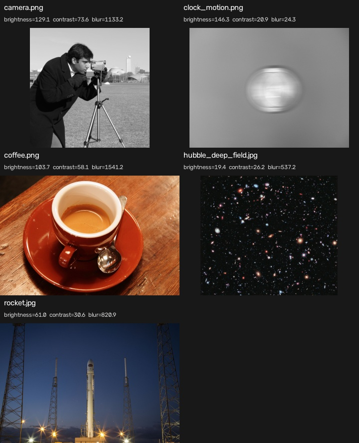

# Image Dataset Inspector

## 日本語概要

このリポジトリは、JPEG・PNGフォルダを再帰的に検査し、画像の縦横寸法、ファイル容量、明るさ、コントラスト、ラプラシアン分散、読み込みエラーをCSVへ出力するPython製コマンドラインツールです。

壊れた画像があっても検査を継続し、入力が同じなら変化しない行順、合成テストデータ、チェックサム付きの公開サンプルを備えています。

Python 3.10〜3.14でテストを自動実行しています。指標の意味、出力仕様、制約の詳細は、以下の英語本文とリンク先の技術資料を参照してください。

---

Audit JPEG and PNG folders from the command line without allowing one broken image to hide the rest of the dataset.

## Overview

Image Dataset Inspector recursively discovers JPEG and PNG files, verifies that OpenCV can decode them, calculates descriptive image statistics, and writes a CSV inventory.

Corrupt files, inconsistent dimensions, and varied image characteristics can otherwise remain hidden until training or image-processing experiments. The scan records file-level failures instead of stopping at the first unreadable image.

This repository inspects inputs. It does not compare vision algorithms like `vision-playground` or maintain a sequence of research studies like `research-notes`.

| At a glance | Evidence |
| --- | --- |
| Supported files | Case-insensitive `.jpg`, `.jpeg`, and `.png` discovery |
| Minimum command | `image-dataset-inspector inspect INPUT --output REPORT.csv` |
| Main output | Deterministic 10-column UTF-8 CSV |
| Failure behavior | Unreadable files remain visible as report rows |
| Compatibility | Version `0.1.2`; Python 3.10 through 3.14 tested in CI |

## Representative Result

The public sample inspects five checksum-verified CC0 or public-domain images and places their measurements beside the source images.



| Image | Brightness | Contrast | Blur score |
| --- | ---: | ---: | ---: |
| `camera.png` | 129.1 | 73.6 | 1133.2 |
| `clock_motion.png` | 146.3 | 20.9 | 24.3 |
| `coffee.png` | 103.7 | 58.1 | 1541.2 |
| `hubble_deep_field.jpg` | 19.4 | 26.2 | 537.2 |
| `rocket.jpg` | 61.0 | 30.6 | 820.9 |

The deliberately motion-blurred clock has the lowest Laplacian variance, while the textured coffee image has the highest. These values describe image content and scale; they are not universal image-quality scores.

Review the complete [`public_sample_report.csv`](examples/public_sample/public_sample_report.csv) and the [interpretation and attribution](examples/public_sample/README.md).

## Quick Start

Python 3.10 or later is required. On Debian or Ubuntu, install `python3-venv` if `venv` reports that `ensurepip` is unavailable.

```bash
git clone https://github.com/cab0a/image-dataset-inspector.git
cd image-dataset-inspector
python3 -m venv .venv
source .venv/bin/activate
python -m pip install --upgrade pip
python -m pip install -e .
python examples/generate_demo_images.py --output output/demo_images
image-dataset-inspector inspect output/demo_images \
  --output output/report.csv
```

Expected summary:

```text
Scanned: 6
Valid: 5
Unreadable: 1
Report: output/report.csv
```

Open `output/report.csv`. It contains one row per discovered image, including the deliberately unreadable `broken.jpg`.

## Generated Artifacts

| Artifact | Contents |
| --- | --- |
| `output/report.csv` | Relative paths, dimensions, channels, metrics, status, and decode errors |
| `output/demo_images/` | Five decodable synthetic images and one corrupt JPEG |
| [`public_sample_report.csv`](examples/public_sample/public_sample_report.csv) | Committed measurements for five public images |
| [`public_sample_contact_sheet.jpg`](examples/public_sample/public_sample_contact_sheet.jpg) | Committed image-and-metric comparison |

## Key Features

- Recursive and case-insensitive `.jpg`, `.jpeg`, and `.png` discovery
- Paths relative to the scan root with a stable sorted order
- File size, dimensions, decoded channel count, and three descriptive metrics
- Per-file `valid` or `unreadable` status without aborting the scan
- UTF-8 CSV with fixed columns and six-decimal metric formatting
- Documented exit codes `0`, `1`, and `2`
- Synthetic failure fixture and checksum-verified public source images

## Evaluation Methodology

The synthetic fixture provides known relative relationships and one explicit decode failure. Tests check that bright exceeds dark, high contrast exceeds uniform, and a sharp checkerboard exceeds its blurred counterpart.

The public sample provides varied, traceable image content without semantic quality labels. It demonstrates metric behavior without presenting the values as acceptance thresholds.

Metric definitions, channel handling, serialization rules, and interpretation boundaries are documented in [Report Schema and Metrics](docs/report-schema.md). Experiment-wide claim boundaries are listed in [Limitations](docs/limitations.md).

## Public Sample Reproduction

```bash
python examples/run_public_sample.py \
  --images output/public-sample/images \
  --output output/public-sample
```

The first run downloads five images pinned to scikit-image `v0.26.0` and verifies each source with SHA-256. It then writes `public_sample_report.csv` and `public_sample_contact_sheet.jpg`.

## Downstream Workflow

The CSV can serve as an explicit input record before a computer-vision experiment. The [Vision Playground inspected sample](https://github.com/cab0a/vision-playground/tree/main/results/inspected_public_sample) demonstrates:

`Input Inspection → Thresholding Prototype → Qualitative Evaluation → Interpretation`

Unreadable files remain in the inspection report, while only valid images continue to the experiment.

## Technical Design

`Discover → Decode → Measure → Record → Continue`

Candidate paths are sorted before inspection. OpenCV loads each image with unchanged channel information, then converts supported channel layouts to grayscale for brightness, contrast, and Laplacian-variance calculations.

Detailed contracts:

- [Command-Line Interface](docs/interface.md): command, arguments, exit codes, failure behavior, and compatibility
- [Report Schema and Metrics](docs/report-schema.md): columns, formatting, channel handling, and metric definitions
- [Reproducibility](docs/reproducibility.md): synthetic and public workflows, deterministic controls, and CI coverage
- [Limitations](docs/limitations.md): metric, file-format, metadata, and scale boundaries

## Reproducibility

The synthetic fixture is generated entirely in code. Public source bytes are pinned with SHA-256. Candidate paths, CSV columns, relative-path formatting, and numeric precision are fixed by the implementation.

See [Reproducibility](docs/reproducibility.md) for commands, expected outputs, provenance, and the complete list of deterministic controls.

## Development and Testing

```bash
python -m pip install ".[dev]"
python -m pytest
```

Eight tests cover recursive discovery, corrupt-image reporting, CSV schema, relative metric behavior, and error exit codes. GitHub Actions installs the package, checks the CLI entry point, and runs the suite on Python 3.10 through 3.14. On Python 3.12, it also executes the README Quick Start and confirms that the report contains all six generated files, including one unreadable image.

## Compatibility

Version `0.1.x` documents the `inspect` command, exit codes, supported extensions, and current CSV columns. It does not declare a `1.x` stability guarantee.

The package root exposes `__version__`; no stable Python API contract is declared for internal modules. See the [interface compatibility boundary](docs/interface.md#compatibility-boundary).

## Project Layout

| Path | Purpose |
| --- | --- |
| `src/image_dataset_inspector/` | Discovery, decoding, metrics, CSV writing, and CLI |
| `tests/` | Synthetic fixtures, metric behavior, reporting, and exit-code tests |
| `examples/` | Synthetic generator and checksum-verified public sample |
| `docs/` | Interface, report schema, reproducibility, and limitations |
| `.github/workflows/ci.yml` | Five-version test matrix |

## License

This project is licensed under the MIT License. See [LICENSE](LICENSE) for details.
